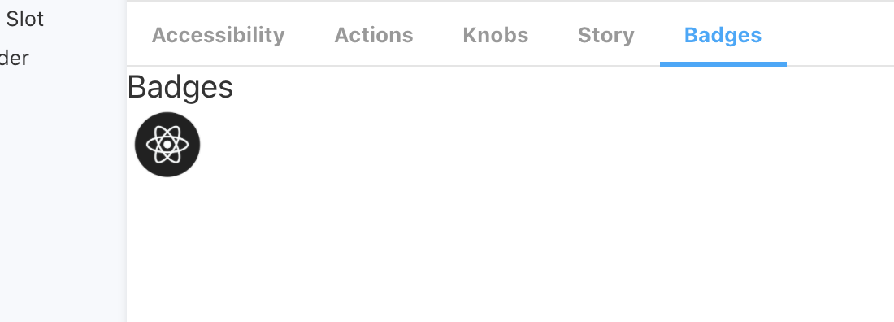

# @faebeee/storybook-badges

Storybook addon to add a new Tab which can show a 
status of the shown component. So you can easily keep
track of the state of a component. For example you can visualize
if it's already release. Or if its a draft or needs a redesign or if it's
still in development

## install

    npm i @faebeee/storybook-badges
    
add the addon

    import '@faebeee/storybook-badges';

configure default config

.storybook/config.js

    import { addDecorator, addParameters } from '@storybook/react';
    addParameters({
        badges: {
            icon_size: 50,
            icons: {
                'utility': {
                    icon: '/assets/img/utility-comp.png',
                    text: "Utility Component"
                },
            }
        },
    });

and in your story

    const stories = storiesOf('Component', module)
       
    stories.add(
        'Default',
        () => (<MyComp/>),
        {
            badges: {
                badges: ['utility'],
            },
        }
    );
